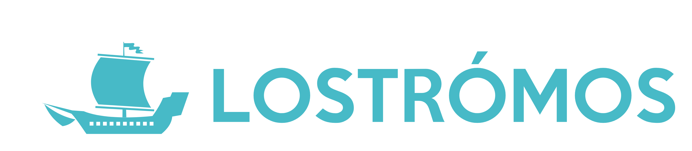

# <a name="usinglostromos"></a>Using Lostrómos

## <a name="reading"></a>Recommended Reading

* [Custom Resource Definitions](https://kubernetes.io/docs/tasks/access-kubernetes-api/extend-api-custom-resource-definitions/)
* [Custom Resources](https://kubernetes.io/docs/concepts/api-extension/custom-resources/)
* [Kubernetes Operators](https://coreos.com/blog/introducing-operators.html)
* [Helm](https://docs.helm.sh/)
* [kubectl](https://kubernetes.io/docs/reference/kubectl/overview/)

## <a name="quickstart"></a>Quick Start

### Dependencies

| Dependency | Version |
| ---------- | ------- |
| `Golang` | 1.9.0+ |
| `Minikube` | 0.22.3+ |
| `Docker` | 17.09.0+ |
| `Python` | 3.0+ |

Install the above dependencies, then run the following script substituting
`your_os_version` for darwin/linux/windows depending on your system.

*This script will install Go and Python dependencies, build Lostrómos, build a
docker image with Lostrómos, then run it in Minikube and perform integration
testing.*

```bash
make install-go-deps
make vendor
make install-python-deps
make build-cross
./out/lostromos-{your_os_version}-amd64 version
minikube start
eval $(minikube docker-env)
make docker-build-test
kubectl create -f test/data/crd.yml
make LOSTROMOS_IP_AND_PORT=`minikube service lostromos --url | cut -c 8-` integration-tests
eval $(minikube docker-env -u) # Unlinks minikube and docker.
```

## <a name="tutorial"></a>Tutorial

To start working with Lostrómos, you should begin by playing around with some
basic CR management. Build Lostrómos via `make build`, then do  the following
steps.

1. Setup kubectl against a cluster. (See [this guide](https://kubernetes.io/docs/getting-started-guides/minikube/)
    for setting up Minikube.)
2. Set up a Custom Resource Definition (CRD).
    * View the [CRD config file](../test/data/crd.yml)
    * Run `kubectl apply -f test/data/crd.yml`
3. Create CR objects for thing1 and thing2
    * View the [CR config file](../test/data/cr_things.yml) for thing1 and thing2
    * Run `kubectl apply -f test/data/cr_things.yml`
4. Start Lostrómos
    * View the [Lostromos config file](../test/data/config.yaml)
      * Lostrómos is set up to watch the CRD you just defined
      * Lostrómos is set up to apply the templates defined [here](../test/data/templates)
        * Templates are defined for an nginx Deployment and a Configmap
    * Run `./lostromos start --config test/data/config.yaml`
    * See that resources were added for thing1 and thing2
      * `{"controller": "template", "resource": "thing1"}`
      * `{"controller": "template", "resource": "thing2"}`
    * Verify resources were created (Switch to new shell for the remainder of
       the tutorial)
      * In another shell run `kubectl get deployments` and verify thing1 and
      thing2 nginx deployments
      * Run `kubectl get configmaps` and verify thing1 and thing2 configmaps
5. Create new resources
    * Run `kubectl apply -f test/data/cr_nemo.yml`
    * Verify that the `nemo-nginx` and `nemo-configmap` were created
6. Edit existing resources
    * Run `kubectl edit character nemo` and edit the `By` field in `spec` to say
      Pixar`
    * Run `kubectl describe configmap nemo-configmap` to verify the change was
    propagated
7. Delete a resource
    * Run `kubectl delete -f test/data/cr_nemo.yml`
    * Verify that the nemo configmap and nginx deployment were deleted
8. Delete all resources
    * Run `kubectl delete -f test/data/crd.yml` to cleanup the rest of the
      test data.

## Customization

### Configuration file/flags

* `crd` (Required) Custom Resource information used to determine what Lostrómos
will watch for add/update/delete
  * `name` (Required) The plural name of the Custom Resource Definition (CRD)
  you want monitored (ex: users)
  * `group` (Required) The group of the CRD you want monitored
  (ex: stable.wpengine.io)
  * `version` (Required) The version of the CRD you want monitored
  * `namespace` The namespace of the CRD you want monitored
  * `filter` Filter to specify if Lostromos will act on a resource
  create/update/delete. For more detailed information about what events happen
  on filtered updates, read up on events [here](./events.md).
* `helm` Information pertaining to helm deployments. Defaults to use the go
template controller if no information is given
  * `chart` Path to helm chart
  * `namespace` Namespace for resources deployed by helm
  * `releasePrefix` Prefix for release names in helm
  * `tiller` Address for helm tiller
* `k8s` Kubernetes configuration file required to run Lostrómos on a different
cluster. Defaults to use local cluster if no config is specified
  * `config` Path to configuration file
* `templates` Path to template directory. If using helm, this is skipped.
Defaults to ""

See `./lostromos start --help` for more info.

[Sample config file](../test/data/config.yaml)

### Templates

#### Helm Templates

From the CR, `metadata.name`, `metadata.namespace`, and `spec` fields are
marshalled. These values are accessible in
Helm as `Values.resource.name`, `Values.resource.namespace`, and
`Values.resource.spec` respectively.

See documentation on [Using Helm](./helm.md) for more info

[Sample helm template](../test/data/helm/chart/templates/deployment.yaml)

#### Go Templates

CR fields are accessible to the template by using .GetField

[Sample go template](../test/data/templates/deployment.yaml.tmpl)

## <a name="deployment"></a>Deployment

### Docker

We don't deploy a docker image with Lostrómos, but instead only release the
binary to github. However, we do build a docker image as part of testing. The
Dockerfile we use for test is available [here](../test/docker/Dockerfile).

## <a name="logs"></a>Logs

* When Lostrómos is running locally, the logs are outputted to the console.
* When running inside a cluster, the logs can be viewed with the
`kubectl log lostromos` command
